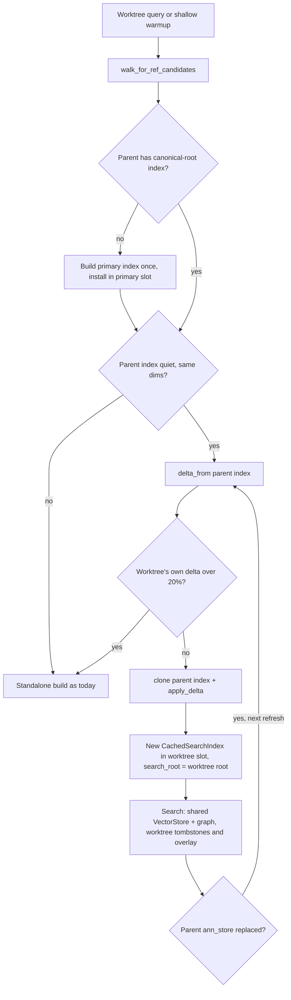

# Worktree Search Index Fork - Plan

## Goal Capsule

- **Objective:** Opening or restarting a session in a linked worktree no longer builds a second vector store and HNSW graph, or a throwaway warmup index, for the whole repository. When a worktree's branch lands on main, the primary does not pay Ollama again for vectors a worktree already computed.
- **Means:** fork the primary's semantic `SearchIndex` into each worktree through the existing #116 delta overlay (KTD1), and on a primary miss look up the vector in the attached worktrees' caches (KTD4).
- **Authority:** Product Contract R-IDs own behavior; KTDs own mechanism; units cite both and override neither.
- **Stop conditions:** stop and report if a fork cannot return the same ranked results as a standalone worktree index on the exact-scan path (R2), or if forking needs a change to instant-distance.
- **Execution profile:** one implementation lane, test-first, one behavior at a time, gated in docker.
- **Finishing:** the implementer lands the units as commits on `feat/worktree-index-fork` and opens a PR. The repository owner merges.

---

## Product Contract

### Summary

A linked worktree's semantic search index becomes a fork of the primary's: it shares the primary's vector store and HNSW graph and holds its own vectors only for the files that differ. It still holds its own copy of the document list; see Deferred to Follow-Up Work. The shallow warmup produces that fork instead of a throwaway second index. The primary reuses a worktree's vectors for files that change to match it.

### Problem Frame

After #119, #120, #123 and #124, a worktree shares the primary's identifier vectors, keyword index, parsed file documents and identifier documents. The semantic `SearchIndex` is the last per-worktree structure still built whole.

On the berries repo (8.3K files, one worktree differing by about 175 files), each worktree still:
- copies the whole vector set into its own `VectorStore`;
- builds its own HNSW graph in the background (11 s CPU at normal load, 74 s under heavy load);
- builds a second, unused full `SearchIndex` during the shallow warmup.

That is CPU and memory proportional to the repository, per worktree, on a shared dev machine that has crashed repeatedly under load today.

The reverse direction is also wasted. When a worktree's branch merges and the primary's files change to match, the primary re-embeds those files through Ollama even though an attached worktree holds the exact vectors (`src/server_adapters.rs` lookup by own path and hash only; `src/server.rs` `incremental_reembed_detailed` falls through to `embed_documents`).

### Requirements

**Fork**
- R1. A linked worktree whose files differ from the primary's by no more than the existing 20% promotion threshold searches a fork of the primary's semantic index: it shares the primary's vector store and graph, and never builds its own graph.
- R2. A forked worktree returns the same ranked results as a standalone index of the worktree's files, wherever the query takes the exact-scan path. Scores are compared rounded, ties by path.
- R3. A worktree past the promotion threshold, or one whose parent index is unavailable, mid-rebuild, scoped to a sub-root, or of different vector dimensions, builds a standalone index as today.

**Lifecycle**
- R4. When the primary replaces its vector store (full rebuild), a forked worktree re-forks over the new store on its next refresh and keeps serving correct results in between.
- R5. The memory budget counts a shared vector store once, not once per ref that holds it.
- R6. The shallow warmup of a worktree produces the fork, not a separate full index.

**Merge-back**
- R7. When a primary file's content matches a file an attached worktree has already embedded, at the same path and content hash, the primary takes that vector instead of calling Ollama. This holds on both the query walk and the tracker path.

### Success Criteria

- On the live berries daemon after a restart with N attached worktrees under the promotion threshold, at most one `hnsw_build` is logged per primary store, and each worktree logs a fork (`semantic_fork` with its `ref_id`), even when no query ran on the primary first.
- The worktree's resident memory from the semantic index drops by at least the size of one full vector store (about 25 MB at 8K files × 768 dims), with no rise in the primary's.
- A primary incremental update on files a worktree already embedded makes zero Ollama embed calls for those files.

### Scope Boundaries

- The primary's own graph, `ef_search`, candidate multiplier and ranking are unchanged. See Open Questions for the finding that default queries skip the graph.
- Merge-back reads only in-memory caches of worktrees still attached. It does not read evicted or removed worktrees' on-disk stores or the CAS.

#### Deferred to Follow-Up Work

- A fork clones the parent's `SearchDocument` list, deep-copying every document's text and token sets. Sharing documents (for example as `Arc<SearchDocument>`) would save one more document-set copy per worktree.
- The worktree walk still reads and hashes every file, and clones inherited vectors, before `delta_from` discards the unchanged ones.
- Below `ANN_THRESHOLD` (2000 embedded files) an index has no shared store, so a fork copies its vector buffer. Only large repositories gain the store sharing.
- `RefWarmupMode::Full` rebuilds a standalone index after the baseline import, which replaces a warmup fork. Only the default `Shallow` mode is in scope.
- Worktree `embedding_cache` still copies inherited parent vectors (`src/server_adapters.rs` ancestor loop inserts them). Reading through the parent instead saves about one more vector-set copy per worktree.
- A clusters query with a query string builds a throwaway `SearchIndex`, and above 2000 files a throwaway graph (`src/tools/semantic_navigate.rs`).
- Merge-back from evicted or removed worktrees, via content-addressed CAS blobs written to the primary's CAS root.
- The doc comment on `import_baseline_for_ref` in `src/server.rs` claims its CAS root matches `incremental_reembed`'s. It does not; fix the comment or the roots.

### Open Questions

- **Default queries never use the HNSW graph (deferred, needs an owner decision).** instant-distance returns at most `ef_search` hits (default 32). The default candidate count is top_k 5 × multiplier 10 = 50. So `src/tools/semantic_search.rs` drops the shortlist and scans exactly on every default query.
  - Before the graph exists, the exact top 50 is used as the shortlist, so results can shift slightly once the graph finishes.
  - The possible fixes all change ranking or build cost: raise `ef_search`, cap candidates at `ef_search`, or skip the graph below a size. This plan does not change it. The fork removes the worktree's share of the waste either way.

---

## Planning Contract

### Key Technical Decisions

- KTD1. **Fork through the existing #116 overlay, not a new layered structure.** A fork is the parent's index diffed against the worktree walk (`delta_from`), cloned, then updated with `apply_delta`. This is exactly the background refresh path in `semantic_code_search_owned` (`src/tools/semantic_search.rs`).
  - `SearchIndex` clones share `ann_store: Arc<VectorStore>`, including its lazy graph and `hnsw_building` flag, so one graph build serves every ref.
  - instant-distance 0.6.1 has no delete or filtered search; the existing caller-side tombstones (`vector_updates`, `ann_dirty_paths`) already cover that.
- KTD2. **A fork is a new `CachedSearchIndex` in the worktree's slot, never the parent's Arc.** `lane_m_attached_worktree_does_not_inherit_primary_semantic_index` in `src/server.rs` forbids handing over the parent entry, whose pending batches, generation and `search_root` belong to the parent. The fork's `search_root` is the worktree's canonical root.
- KTD3. **Fork only from a quiet, full-root, same-dims parent, and promote by the worktree's own delta.** These mirror the #120 stale-base rules in `layered_lexical_index`:
  - the parent entry exists and its `search_root` equals its canonical root;
  - it has no pending batches and no rebuild running;
  - the dims match;
  - the worktree walk covers the worktree's full root.

  Promotion is decided by the worktree's own delta: the changed and deleted counts from `delta_from` against the parent's document count, at the same 20% threshold. It is not decided by `requires_full_rebuild` on the clone, because the clone inherits the parent's accumulated `ann_dirty_paths` and a long-running primary would then refuse every fork. If a fork is not possible, build standalone as today (R3).
- KTD6. **The worktree makes the primary's index forkable when it isn't.** After a restart, sessions run in worktrees, so the primary usually has no index with its canonical `search_root`; its shallow warmup index has an empty one. The worktree path therefore builds the primary's canonical-root index once, installs it in the primary's slot, and forks from it. This mirrors #124's `parent_identifier_index`. The primary's baseline warmup also sets `search_root` to its canonical root.
- KTD7. **A fork replaces a worktree entry only when its store is stale, and never loses queued work.** Fork when the worktree slot is empty or its `ann_store` is not `Arc::ptr_eq` with the parent's current store. Install under the slot's write lock only if the slot still holds the entry seen before the walk, carrying its unconsumed pending batches, as `semantic_code_search_owned`'s refresh does. When the primary installs a new store, it bumps each attached child's `cache_generation` so idle worktrees re-fork on their next query.
- KTD4. **Merge-back by `(path, content hash)` lookup in attached children's in-memory caches.** On a primary miss, look in each attached child ref's `embedding_cache` before Ollama, with the same revalidation and `observed` race checks the ancestor loop uses.
  - Matching the path too is required, because the embedding text includes the path (`build_embedding_document`).
  - This needs no disk format change and covers the live case where the worktree is still attached when its branch lands.
- KTD5. **Seed the fork in the ref adapter, not in the generic search.** `walk_for_ref_candidates` (`src/server_adapters.rs`) already fetches the parent's `CachedSearchIndex` (#123). Seeding the worktree slot there keeps `semantic_code_search`'s `WalkAndIndexFn` unaware of parents.

### High-Level Technical Design

Merge-back sits on the primary's miss path. Lookup order: own cache by path and hash, then attached children's caches by path and hash (the new step), then CAS by path (existing behavior, unchanged), then Ollama.

### Assumptions

- A worktree's graph build is wasted today: default queries take the exact path (Open Questions), and the fork shares one graph anyway. Removing it cannot worsen default results.
- Attached worktrees usually outlive the merge of their branch long enough for the primary's next update to find their vectors. When they don't, the primary embeds as today.

### Sources

- `src/tools/semantic_search.rs`:
  - `SearchIndex` (derives Clone);
  - `apply_delta`, `delta_from`, `requires_full_rebuild`;
  - the ANN shortlist fallback in `search`;
  - `semantic_code_search_owned`'s refresh recipe;
  - `estimated_resident_bytes`.
- `src/core/embeddings.rs`:
  - `VectorStore` with its `OnceLock` graph and `hnsw_building`;
  - `find_nearest_without_waiting`;
  - `hnsw_test_seam`.
- `src/server_adapters.rs`: `walk_for_ref_candidates`. It covers the parent document reuse (#123), the own-cache lookup by path and hash, and the ancestor loop.
- `src/server.rs`:
  - `layered_lexical_index` (the #120 stale-base rules);
  - `ResidentParts::measure` and `own_resident_bytes` (memory dedup);
  - `import_baseline_for_ref` (shallow warmup);
  - `incremental_reembed_detailed` (the tracker's miss path).
- instant-distance 0.6.1 `src/lib.rs`: no delete or filter; `search` is truncated to `ef`; not deterministic (random seed, parallel insertion).

---

## Implementation Units

### U1. Fork a worktree's semantic index from the primary's

- **Goal:** a worktree under the promotion threshold searches a fork that shares the primary's vector store and graph.
- **Requirements:** R1, R2, R3; KTD1, KTD2, KTD3, KTD5, KTD6, KTD7.
- **Dependencies:** none.
- **Files:** `src/server_adapters.rs`, `src/tools/semantic_search.rs`, `ARCHITECTURE.md`; tests in `src/tools/semantic_search.rs` (unit) and `src/server.rs` (server-level).
- **Approach:**
  1. Add a `SearchIndex` fork operation over `delta_from`, `clone` and `apply_delta`. It returns `None` when the worktree's own delta passes the KTD3 threshold.
  2. In `walk_for_ref_candidates`, before forking, make the parent forkable per KTD6.
  3. After the walk, fork per KTD7's replacement rule and install a new `CachedSearchIndex` for the worktree. Log a `semantic_fork` phase with the worktree's `ref_id`. Otherwise leave today's standalone path untouched.
  4. Use the calibration the fork computes over its own effective documents; add no special-casing.
- **Execution note:** start each behavior with a failing test; write the property test before the adapter change.
- **Patterns to follow:**
  - `delta_over_masked_base_matches_standalone_index_of_random_edits` in `src/tools/lexical_search.rs`, for the seeded random-edit loop and the (score, path) comparison;
  - the `lexdelta_*` server tests and helpers in `src/server.rs`;
  - `attached_worktree` and `identifier_test_server` in `src/server.rs`.
- **Test scenarios:**
  - Property: for 60 seeds of random edits, adds and deletes on a corpus below `ANN_THRESHOLD`, the forked index returns the same (path, rounded combined score, keyword score) list as a standalone index, sorted by score then path.
  - Property above `ANN_THRESHOLD` at default top_k, which takes the exact path: same equality as above.
  - Structural: after a worktree query, the worktree entry's `ann_store` is `Arc::ptr_eq` with the primary's, and the worktree slot's `CachedSearchIndex` is not the primary's Arc.
  - Structural: with `hnsw_test_seam`, a worktree query on a forked index starts no graph build of its own.
  - Promotion: a worktree with more than 20% changed files builds a standalone index whose store is not shared.
  - Long-running primary: a parent whose accumulated dirty paths exceed 20% still forks a worktree whose own diff is small.
  - Restart: with no query on the primary and only its warmup index present, a worktree's first query builds the primary's canonical-root index once, installs it in the primary's slot, and forks from it.
  - Replacement: a walk over a worktree whose fork already shares the parent's current store keeps the entry and its queued batches; a racing install over a changed slot is dropped.
  - Parent unavailable (no primary entry, a rebuild in progress, pending batches, or a scoped sub-root search): the worktree builds standalone, and its results equal the standalone reference.
  - Dims mismatch between parent and worktree vectors: standalone build, no panic.
  - `lane_m_attached_worktree_does_not_inherit_primary_semantic_index` still passes unchanged.
- **Verification:** the new tests pass, all existing `semantic_search`, `lane_m` and #123 tests still pass, and a live restart shows at most one `hnsw_build` per primary store plus a `semantic_fork` line per worktree.

### U2. Re-fork on primary rebuild and count the shared store once

- **Goal:** a fork stays correct and fairly counted when the primary replaces its store.
- **Requirements:** R4, R5; KTD3, KTD7.
- **Dependencies:** U1.
- **Files:** `src/server_adapters.rs` or `src/tools/semantic_search.rs` (re-fork check), `src/server.rs` (child generation bump, `ResidentParts::measure`); tests in `src/server.rs`.
- **Approach:**
  1. When the primary installs a new `ann_store`, bump each attached child's `cache_generation` (KTD7), so the child's next query walks and re-forks per U1 even when its own files are quiet.
  2. Split the semantic index's resident accounting into the shared `VectorStore`, deduped by pointer, and the index's own bytes, the same way `own_resident_bytes` splits the lexical base.
- **Patterns to follow:**
  - `lexdelta_primary_base_replacement_keeps_worktree_results_correct` and the pinned-base accounting test in `src/server.rs`;
  - `lane_m_memory_budget_skips_worktrees_holding_only_shared_caches`.
- **Test scenarios:**
  - After a fork, the primary edits, adds and deletes files incrementally. The worktree's results still equal its standalone reference.
  - The primary does a full rebuild (new store). Before the worktree refreshes, its results are still correct on the old store. After the refresh, its `ann_store` is `Arc::ptr_eq` with the new one.
  - An idle worktree (no file changes of its own) re-forks onto the new store on its first query after a primary full rebuild.
  - The memory budget counts a store shared by the primary and two forked worktrees once. A worktree pinning an old store after a primary rebuild is charged for it.
  - `lane_m_memory_budget_skips_worktrees_holding_only_shared_caches` still passes.
- **Verification:** tests pass, and the budget log on the live daemon does not grow by a full store per attached worktree.

### U3. Shallow warmup produces the fork

- **Goal:** the default `RefWarmupMode::Shallow` stops building a second full index per worktree.
- **Requirements:** R6; KTD1, KTD2, KTD6.
- **Dependencies:** U1.
- **Files:** `src/server.rs` (`import_baseline_for_ref`); tests in `src/server.rs`.
- **Approach:**
  1. Build the fork's input in the walk's document shape: `file_document` over `semantic_embedding_content` with `source_hash` set, reusing parent documents by path and hash as `walk_for_ref_candidates` does. Take vectors from the parent's embedding cache or CAS hits, with no Ollama call. The baseline import's own `SearchDocument::new` documents never diff clean against the parent's.
  2. Pass that input to U1's fork operation and install the fork with a generation older than the ref's current `cache_generation`. The first query is then served from the fork while its background refresh walks and queues the worktree's changed files for fill.
  3. The primary's own baseline import sets `search_root` to its canonical root (KTD6). Otherwise keep today's behavior.
- **Patterns to follow:** `ref_warmup_full_layers_ollama_on_baseline` and the existing shallow-warmup tests in `src/server.rs`.
- **Test scenarios:**
  - A shallow warmup of a worktree under the threshold leaves a forked entry whose store is shared with the primary.
  - The first query after it logs no `semantic_index_build` and no `hnsw_build`, and queues the worktree's changed files for fill. Once the fill finishes, it returns the same results as the standalone reference.
  - A shallow warmup with no primary index forks after building the primary's index (KTD6).
  - The primary's baseline warmup leaves an index with its canonical `search_root`, which a worktree can fork.
- **Verification:** tests pass. On the live daemon, the first worktree query after warmup logs no `semantic_index_build` over the whole repository and no `hnsw_build`.

### U4. Primary reuses attached worktrees' vectors

- **Goal:** a primary file that now matches a worktree's embedded file takes that vector instead of calling Ollama.
- **Requirements:** R7; KTD4.
- **Dependencies:** none. It can land before or after U1–U3.
- **Files:** `src/server_adapters.rs` (walk miss path), `src/server.rs` (`incremental_reembed_detailed` miss path, and a helper listing attached child refs); tests in `src/server.rs`.
- **Approach:**
  1. Add a shared lookup that scans attached children of a primary ref for an entry with the same path and content hash.
  2. Apply the ancestor loop's `is_current` revalidation and `observed` race checks, then use the lookup in both miss paths before the CAS and Ollama.
  3. Copy the vector into the primary's own cache so the primary does not depend on the child staying attached.
- **Patterns to follow:**
  - the ancestor loop in `walk_for_ref_candidates`;
  - `attached_worktree_reuses_primary_vectors_and_embeds_only_changed_files` in `src/server.rs`;
  - the wiremock embed counter in `identifier_test_server`.
- **Test scenarios:**
  - A worktree embeds an edited file. The primary's copy is then changed to the same content. The primary's query walk makes zero embed calls for it, and its vector equals the worktree's.
  - The same through the tracker path (`incremental_reembed_detailed`): zero embed calls.
  - Same content at a different path in the worktree: no reuse, one embed call.
  - Same path with different content: no reuse, one embed call.
  - The worktree is detached before the primary update: the primary embeds as today.
  - The worktree's entry is replaced during the lookup (race): the primary falls back to embedding and never takes a stale vector.
- **Verification:** tests pass. On the live daemon, merging a worktree branch into `/workspace` logs no Ollama embed calls for files the worktree had already embedded.

---

## Verification Contract

| Gate | Command or check | Applies to |
|---|---|---|
| Format | `cargo fmt --check` | every unit |
| Lint | `cargo clippy --all-targets --all-features -- -D warnings` | every unit |
| Tests | `cargo test --all-features`, run as the non-root `tester` user in the docker gate container | every unit |
| CI | GitHub Actions: Linux and macOS test, MSRV 1.88, release builds | the PR |
| Live | install on the shared daemon, restart, run the smoke test from a worktree, and read `daemon.log` phases | after merge, the owner's release step |

Known local-only failures that are not regressions:
- `cold_start_loaded_keyword_index_holds_no_more_than_a_built_one` is off by 128 bytes on the container toolchain, and also fails on main.
- `lane_c_timeout_names_command_and_keeps_other_results` flakes under host load.

---

## Definition of Done

- R1–R7 each have a passing test named in U1–U4, and each test failed before its fix.
- There are no new files. Tests sit beside their existing peers in `src/tools/semantic_search.rs` and `src/server.rs`.
- The full docker gate is green apart from the two known local-only failures, and CI is green on Linux and macOS.
- No code from abandoned approaches remains in the diff.
- `ARCHITECTURE.md` gets one line on worktree index forking, next to the #120 base-plus-delta note.
